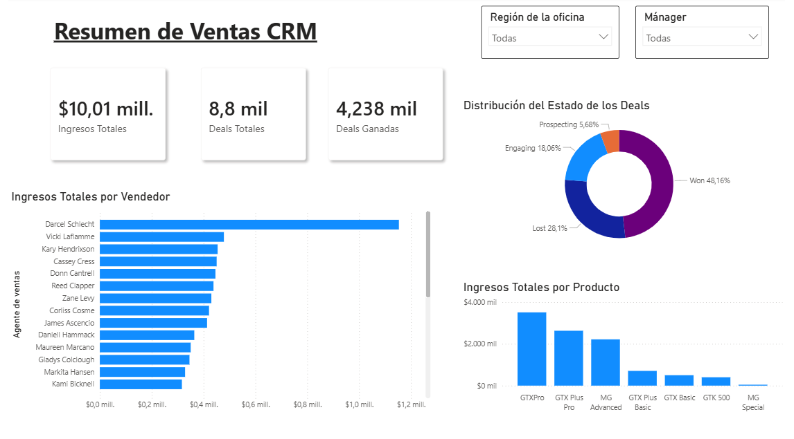
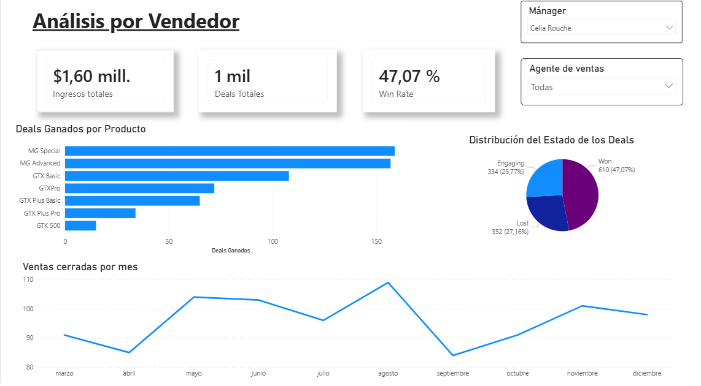
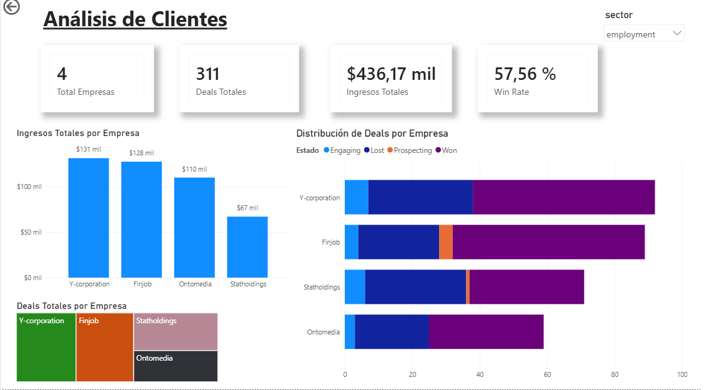
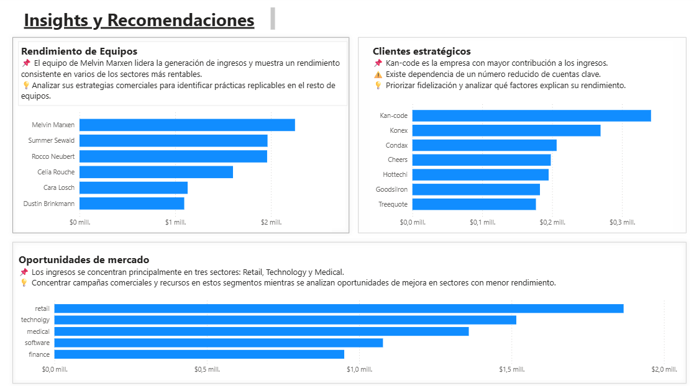

# CRM Sales Analysis with Power BI

**Author:** Carolina H. M.

**Data Source:** Maven Analytics Data Playground – CRM Sales Opportunities Dataset

---

## Project Overview

This project analyzes a CRM sales dataset using Power BI.

The objective is to transform commercial data into useful business information through interactive dashboards focused on sales performance, customer analysis and business insights.

---

## Project Goals

- Analyze overall sales performance.
- Identify top-performing teams and sales managers.
- Detect strategic customers.
- Analyze the most profitable business sectors.
- Generate business insights from data.
- Provide data-driven recommendations.

---

## Tools Used

- Power BI
- Power Query
- DAX
- Data Modeling
- Data Visualization

---

## Dashboard 1 - CRM Sales Overview

Includes:

- Total Revenue
- Total Deals
- Won Deals
- Deal Status Distribution
- Revenue by Sales Agent
- Revenue by Product

---

## Dashboard 2 - Sales Performance Analysis

Includes:

- Revenue by Manager
- Win Rate
- Monthly Closed Deals
- Opportunity Distribution
- Product Performance

---

## Dashboard 3 - Customer Analysis

Includes:

- Revenue by Company
- Opportunity Distribution by Customer
- Top Revenue Accounts
- Sector Analysis
- Win Rate

---

## Dashboard 4 - Business Insights & Recommendations

Key findings:

### Team Performance

Melvin Marxen's team generates the highest revenue and consistently performs well across several of the most profitable sectors.

### Strategic Customers

Kan-code is the company's most valuable customer account and represents a key opportunity for retention strategies.

### Market Opportunities

Retail, Technology and Medical sectors generate the largest share of total revenue.

### Recommendations

- Replicate successful practices from top-performing teams.
- Prioritize retention initiatives for key accounts.
- Focus resources on the most profitable sectors.
- Investigate opportunities for improvement in lower-performing sectors.

---

## About This Project

This project is part of my Data Analytics portfolio and was developed as a practical exercise in Business Intelligence, data visualization and business-oriented analysis.
